### Ext.MessageBox

Ext.MessageBox是一个工具类，提供了各种风格的信息提示对话框，也可以简写为Ext.Msg,这在Ext中很常见,很多组件或类都可以使用简写形式。

#### 常用方法

##### alert-告警框

显示一个标准的带有一个“确定”按钮的只读消息盒子(类似于警告提示)

window_messagebox.js

```js
Ext.onReady(function(){
	Ext.Msg.alert('标题', '提示内容');
})
```

window_messagebox.html

```html
<!DOCTYPE html>
<html lang="en">

<head>
    <meta charset="UTF-8">
    <meta name="viewport" content="width=device-width, initial-scale=1.0">
    <title>Document</title>

    <link rel="stylesheet" type="text/css" href=".\tool\ext-4.2.1.883\resources\css\ext-all.css" />
    <script type="text/javascript" charset="utf-8" src=".\tool\ext-4.2.1.883\ext-all-debug.js"></script>
    <script type="text/javascript" charset="utf-8" src=".\tool\ext-4.2.1.883\locale\ext-lang-zh_CN.js"></script>
    <script type= "text/javascript" charset="utf-8" src=".\window_messagebox.js"></script>
</head>

<body>
</body>

</html>
```

效果:


##### confirm-确认框

显示一个带有“YES”和“NO”按钮的确认消息盒子（类似于JavaScript的确认）

js

```js
Ext.onReady(function() {
			Ext.Msg.confirm('删除告警提示', '是否删除该条记录', function(op) {
						if (op == 'yes') {
							Ext.Msg.alert('提示', '已删除')
						} else {
							Ext.Msg.alert('提示', '已取消删除')
						}
					}, this)
		})
```


##### prompt-输入框

显示一个带有“确定”和“取消”按钮，提供用户输入一些文本的消息盒子(类似于JavaScript的提示)。 提示可以是一个单行或者多行的文本框。btn的值为:yes或者ok

```js
Ext.onReady(function() {
			Ext.Msg.prompt('标题', '请输入你的名字:', function(btn,
							text) {
						if (btn == 'ok') {
							// 处理文本值并且关闭...
							console.log('callback到的信息',text)
						}
					});
		})
```


multiline 参数设置为真时使用defaultTextHeight属性创建一个多行文本框，或者以px为高度单位的文本框

```js
Ext.onReady(function() {
			Ext.Msg.prompt('标题', '请输入你的名字:', function(btn,
							text) {
						if (btn == 'ok') {
							// 处理文本值并且关闭...
							console.log('callback到的信息',text)
						}
					},this,true);
		})
```


##### wait-等待框

显示一个带一个无限自动更新进度条的消息盒子。 这可以用来阻止用户交互，同时等待一个长期运行不定义的时间间隔的过程完成。 响应当进程完成时，关闭消息盒子。

```js
Ext.onReady(function() {
			Ext.Msg.wait('消息内容', '消息标题', {
						interval : 400, // 循环时间间隔
						duration : 2000, //总时长
						increment : 5, //执行进度条的次数
						text : 'Updating...', //进度条上提示的文字
						scope : this,
						fn : function() {
							//进度条执行完后的回调
							alert('更新成功')
//							p.updateText('Done!');
						},
						animate: true //进度条平滑渲染
					})
		})
```


##### show-自定义提示框

```js
Ext.onReady(function() {
			Ext.Msg.show({
				title : '我是自定义提示框',
				msg : '我是内容:',
				height : 300,
				width : 300,
				buttons : Ext.Msg.OKCANCEL,// 静态属性
				multiline : true,
				// fn: saveAddress, //回调函数
				// animateTarget: 'addAddressBtn',
				icon : Ext.Msg.INFO // ext自带的图标有，ERROR/INFO/QUESTION/WARNING
				});
		})
```

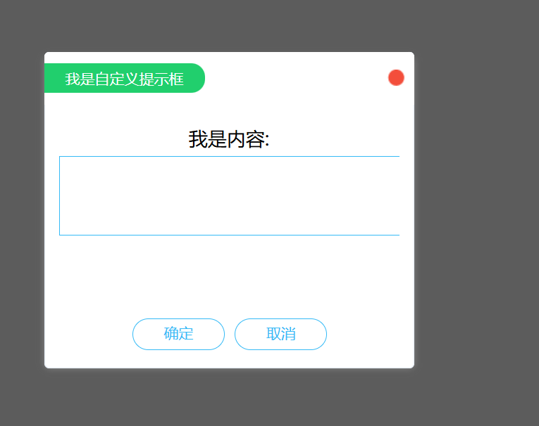


### Ext.window.Window

#### 常用配置项(config)

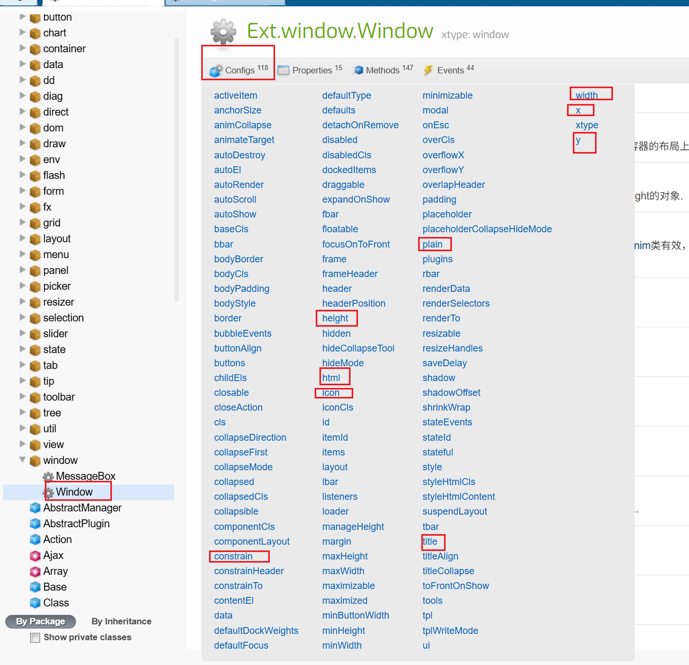

```js
Ext.onReady(function() {

	Ext.create('Ext.window.Window', {
		title : 'window组件',
		height : 200,
		width : 400,
		layout : 'fit',//窗口布局
		constrain : true,// 限制窗口不超出浏览器边界
		modal : true, // 将窗口设置成模态窗口（加一个遮罩层，不能对父组件页面操作）
		x : 50,// 在初始显示时，该窗口的左边缘的X位置
		y : 50, // 在初始显示时，该窗口的上边的Y位置
		autoScroll : true, // 增加滚动条
        //在windows组件中写html
		html : '<div style="width: 200px;height:200px">你好</div style="width: 200px;height:200px"><div>世界</div>'
	}).show();
})
```

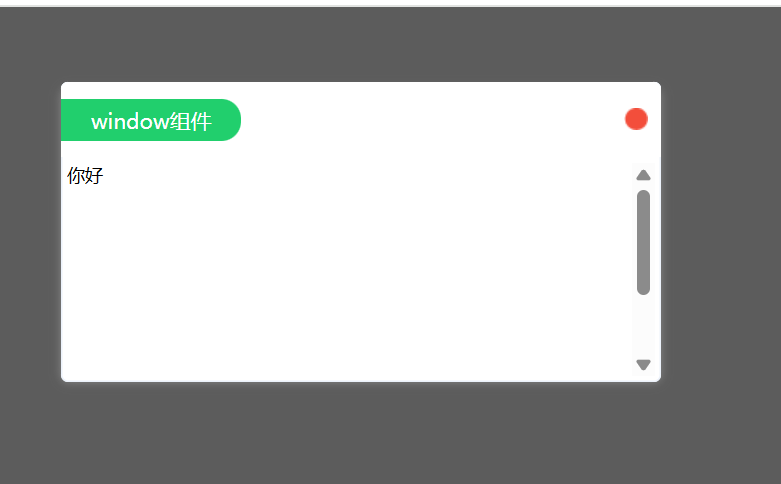

#### 实用例子

##### 1.点击一个按钮，打开一个新的窗体

```js
Ext.onReady(function() {
			// 根据元素id获取元素,经过ext包装后的对象
			var btn = Ext.get('btn');
			// 获取元素的值
			console.log(btn.dom.value);
			// 给按钮元素绑定事件
			btn.on('click', function() {
						Ext.create('Ext.window.Window', {
									title : '新窗体',
									height : 300,
									width : 400
								}).show();
					})
		})
```

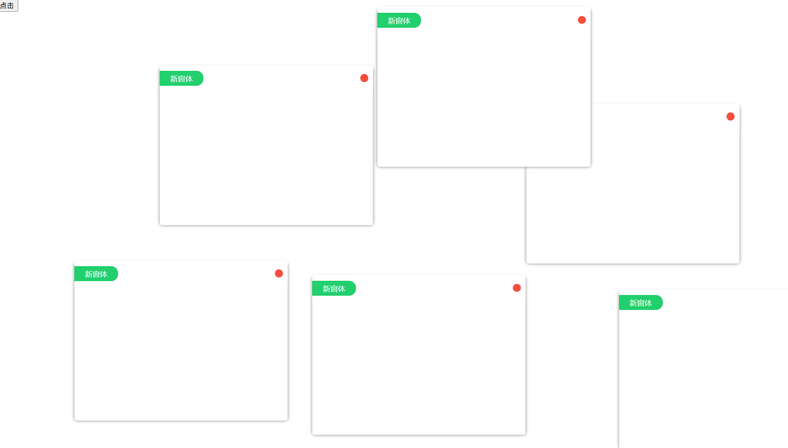

多次点击按钮，会重复创建新的窗体。

（1）使用modal模态属性解决重复创建的问题。

```js
Ext.onReady(function() {
			// 根据元素id获取元素,经过ext包装后的对象
			var btn = Ext.get('btn');
			// 获取元素的值
			console.log(btn.dom.value);

			// 给按钮元素绑定事件
			btn.on('click', function() {
						Ext.create('Ext.window.Window', {
									title : '新窗体',
									height : 300,
									width : 400,
									// 解决重复点击的问题，增加模态属性
									modal : true
								}).show();
					})
		})
```

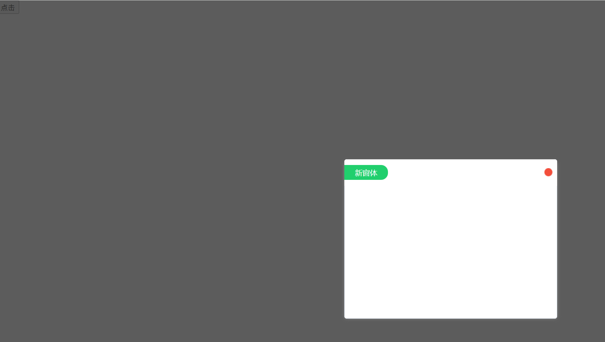

（2）给组件增加唯一id,并且创建前判断组件是否存在。

```js
Ext.onReady(function() {
			// 根据元素id获取元素,经过ext包装后的对象
			var btn = Ext.get('btn');
			// 获取元素的值
			console.log(btn.dom.value);

			// 给按钮元素绑定事件
			btn.on('click', function() {
						if (!Ext.getCmp('mywin')) {
							Ext.create('Ext.window.Window', {
										id : 'mywin',
										title : '新窗体',
										height : 300,
										width : 400
									}).show();
						}
					})
		})
```

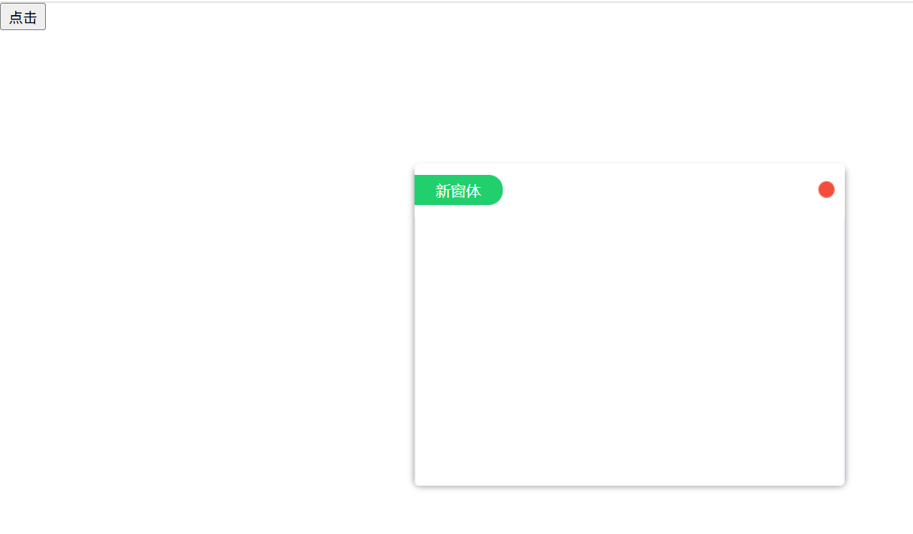

##### 2.在组件中添加子组件

主要是通过组件中的items配置项去添加

```js
 Ext.onReady(function() {
			var win = new Ext.window.Window({
						title : '新窗体',
						height : 300,
						width : 400,
						draggable : false,// 不允许拖拽
						resizable : false, // 不允许窗体改变大小
						closable : false,// 不显示关闭按钮
						collapsible : true,// 显示折叠窗体的按钮
						bodyStyle : 'background:#ffc; padding:10px;',
						html : '窗体内容',
						// 配置子组件的配置项
						items : [{
								// Ext组件提供了一个简单的写法，xtype属性去创建属性
									xtype : 'panel',
									height : 100,
									width : '50%',
									html : '我是子组件-panel面板组件'
								}, {
									xtype : 'button',
									text : '按钮',
									//给按钮绑定事件
									handler : function(btn) {
										alert('被点击了');
										alert(btn.text);
									}
								}]
					});
			win.show();
		})
```

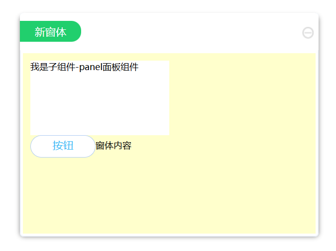

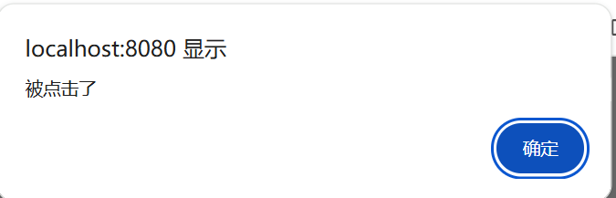


##### 3.在组件中添加子组件,并对子组件进行一系列针的操作

除了使用items添加子组件，还可以使用便捷的方式增加子组件，例如tbar

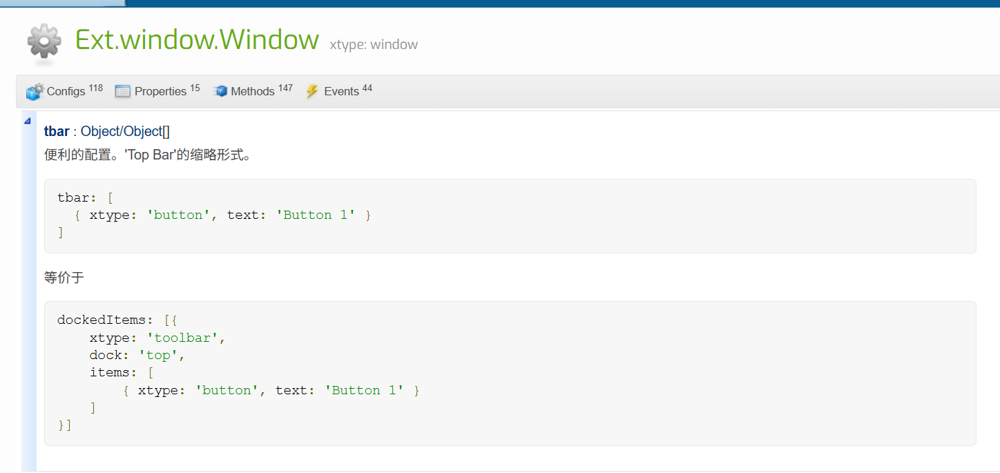

```js
Ext.onReady(function() {
			var win = new Ext.Window({
						title : '操作组件的形式',
						width : 500,
						height : 300,
						id: 'mywin',
						// 在当前组件的top位置加一个工具条。
						//bbar-底部左侧增加工具条 lbar-左侧增加工具条 rbar-右侧增加工具条 fbar-底部右侧增加工具条
						tbar : [{
									text : '按钮1',
									handler : function(btn) {
										//组件都会有up(向上查找)和down(向下查找)方法,需要的参数是组件的xtype或者选择器
										//子组件获取父组件的信息-方式一
										console.log('方式一，父组件window的title值:',btn.up('window').title);
									}
								}, {
									text : '按钮2',
									handler : function(btn) {
										//子组件获取父组件的信息-方式二-常用:给父组件绑定id,通过getCmp获取组件信息
										console.log('方式二，父组件window的title值',Ext.getCmp('mywin').title)
									}
								}, {
									text : '按钮3',
									handler : function(btn) {
                                        //子组件获取父组件的信息-方式三,以上一级组件的形式去查找
										console.log('方式三，父组件window的title值',btn.ownerCt.ownerCt.title)
									}
								}]
					});
					win.show();
		})
```

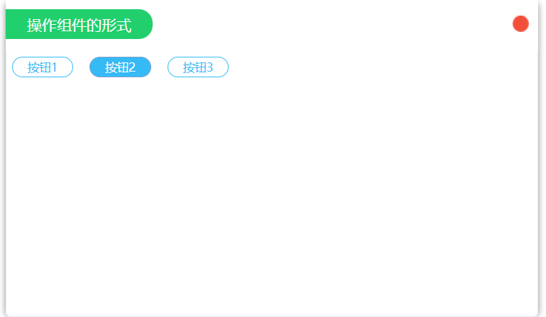

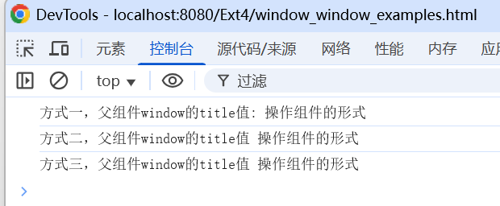
